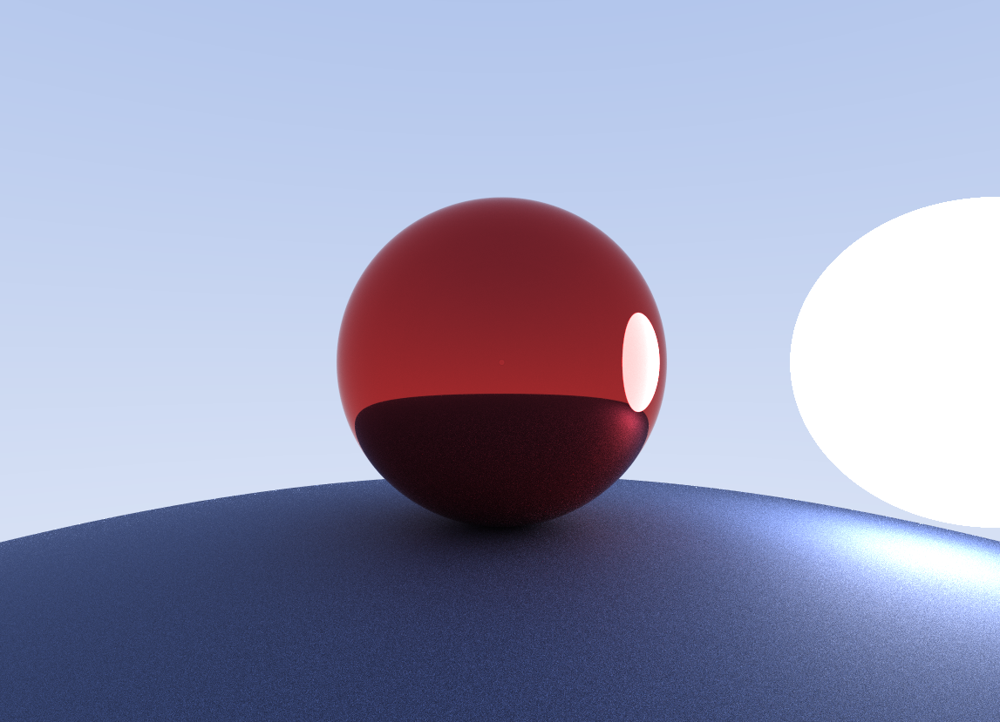

# Path Tracer

This is a software Path Tracer built as a learning project initially following [The Cherno's Ray Tracing series](https://youtube.com/playlist?list=PLlrATfBNZ98edc5GshdBtREv5asFW3yXl&si=ZwHQRIjvuAOiruBz) however it includes several enhancements and custom features to deepen my understanding of computer graphics and rendering. The goal is to understand the fundamentals of graphics programming (particularly ray tracing) and practise using C++.

## Features

- Path Tracing: Monte Carlo path tracing with progressive sample accumulation for realistic global illumination and indirect lighting.
- Disney BRDF: Physically based shading model with per-material controls for base colour, roughness, metallic and specular.
- Importance Sampling: GGX VNDF importance sampling for faster convergence and reduced noise.
- Emissive Materials: Customisable emissive materials with adjustable colour and intensity.
- Geometry: Scene composed of spheres with adjustable position and radius.
- BVH Acceleration: Bounding Volume Hierarchy for efficient ray-scene intersection in large scenes.
- Camera Controls: Freely moveable and rotatable camera for interactive scene exploration.
- Anti-Aliasing: Jittered sub-pixel sampling to smooth edges and reduce aliasing.
- Multi-threading: Multi-core CPU rendering for improved performance.
- Interactive UI: Real-time parameter editing for materials, lighting and scene objects via an immediate-mode GUI.

## Screenshots

### Metal objects

### Diffuse objects

### Multiple light sources

