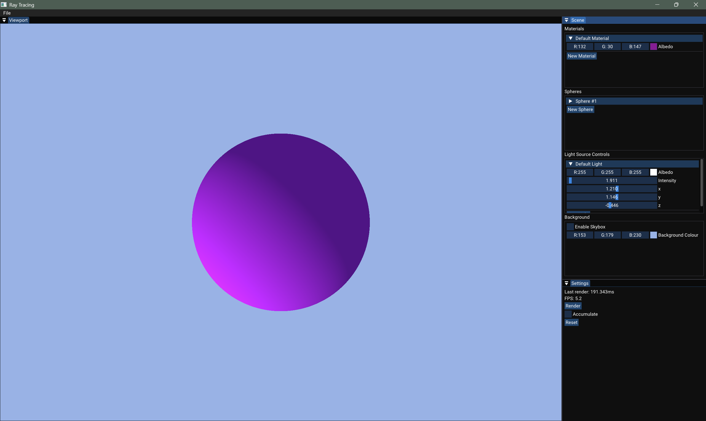

# Ray Tracer

This is a CPU-based Ray Tracer built as a learning project initially following [The Cherno's Ray Tracing series](https://youtube.com/playlist?list=PLlrATfBNZ98edc5GshdBtREv5asFW3yXl&si=ZwHQRIjvuAOiruBz) however it includes several enhancements and custom features to deepen my understanding of computer graphics and rendering. The goal is to understand the fundamentals of graphics programming (particularly ray tracing) and practise using C++.

## Features
- Basic ray tracing: Supports spheres.
- Lighting: Implements distant and spherical lights and support for multiple light sources.
- Shadows: Casts shadows from objects.
- Reflections: Recursive ray tracing for reflective surfaces.
- Path Tracing: Monte Carlo sample accumulation for realistic indirect lighting.
- Camera Controls: Move and rotate the camera to explore the scene interactively.
- Interactive UI: Adjust scene parameters (e.g. materials, lighting etc) in real time.
- Multi-threading: Uses multiple CPU cores for faster rendering.

## Planned Features

- Refractions / dielectric materials.
- Anti-aliasing via supersampling.
- Basic acceleration structure (BVH) for faster rendering.
- Area lights for more realistic lighting.

## Screenshots

### Basic diffuse objects

### Multiple light sources

### Reflective objects/Metal materials

### Shadows

### Spherical light source

